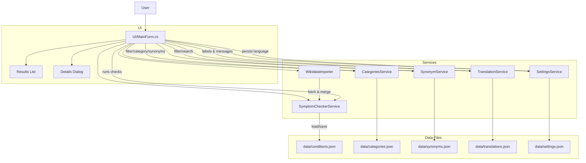
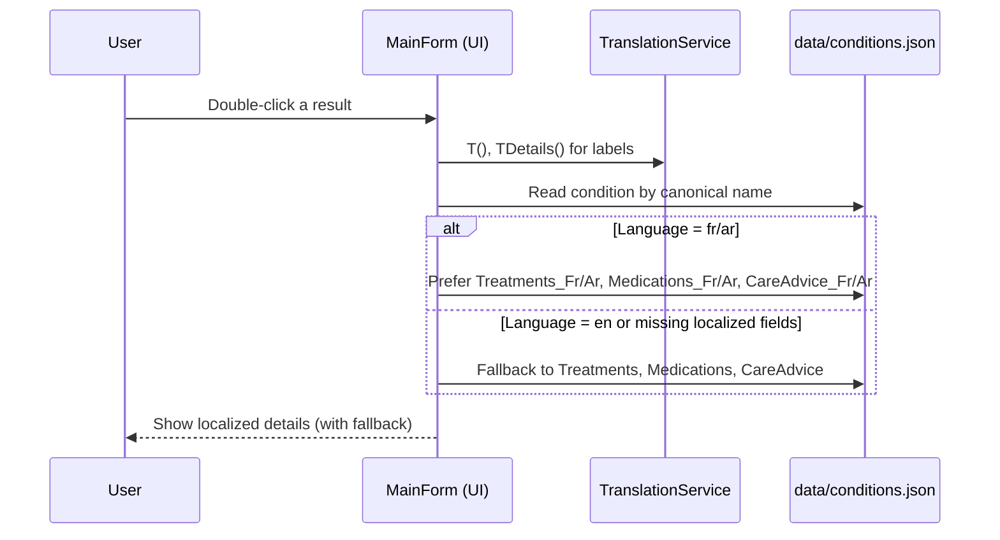

# Symptom Checker (Educational)

A Windows Forms desktop app in C# where you select symptoms from a predefined list and the app suggests possible conditions from a JSON dataset. No free text input; it’s list-based for simplicity and learning.

- Input: Checkboxes only (no free text)
- Data: `data/conditions.json`
- Output: Suggested condition names with scores and a clear disclaimer

## Requirements

- .NET 8 SDK (Windows)

## Run

1. Open this folder in VS Code.
2. Build and run.

Optional commands (PowerShell):

```powershell
# Restore and build
dotnet restore; dotnet build

# Run
dotnet run
```

## Features at a glance

- Three detection models: Jaccard, Cosine (binary), Naive Bayes (Bernoulli with Laplace smoothing)
- Threshold (%), Min Match Count, and Top‑K result limiting
- Symptom filter box with “Select Visible” / “Clear Visible”; selections persist across filters
- Category selector with “Select Category” / “Clear Category” (quick-pick symptoms by system)
- Optional “Show only category” toggle to restrict the symptom list to the selected category (auto-enabled when you change the category)
- Synonym-aware filtering (e.g., typing “Rhinorrhea” matches “Runny Nose”)
- Laboratory Findings category: common lab findings are selectable (e.g., Low Hemoglobin/Hematocrit, Low Ferritin, High WBC/CRP/ESR, Elevated ALT/AST/Bilirubin/ALP, Elevated Amylase/Lipase, High Fasting Glucose/HbA1c, High/Low TSH, Low/High Free T4, Low Vitamin D). These also group in results.
- Single‑click selection in the symptom list (no double‑click needed)
- Shows only conditions that actually share ≥1 selected symptom
- Highlights the most probable result(s) in the results list
- Double‑click a result to view a details dialog (name, score, matches, full symptom list)
- “Sync” button to import latest disease–symptom pairs from Wikidata (no API key), merge, and save
- Exit button for quick close; “Check” disabled until at least one symptom is selected

## How to use

1. Use the filter box to quickly find symptoms. Click “Select Visible” to check all currently filtered items, or “Clear Visible” to uncheck them. Your previous checks are preserved when you change the filter text.
2. Pick a detection model from the dropdown:
	- Jaccard: set overlap (good baseline)
	- Cosine (binary): vector similarity on presence/absence
	- Naive Bayes: probabilistic model with smoothing; scores are normalized
3. Adjust parameters as needed:
	- Threshold (%): minimum score to keep a result
	- Min Match: require at least N overlapping symptoms
	- Top‑K: show only the top K matches (optional)
4. Click “Check” to compute matches. Results show “Condition — Score: X.XX — Matches: N”. The top score is highlighted. Only real matches are shown.
5. Double‑click a result to open a details dialog with the full symptom list.

Tip for labs: Use the Category selector and choose “Laboratory Findings” to quickly pick lab items like High WBC, Elevated ALT/AST, High HbA1c, etc.

Tip: Start with Jaccard and a low threshold (e.g., 0–30%) for exploratory use.

## Detection models

- Jaccard: |A ∩ B| / |A ∪ B| on sets of symptoms (selected vs condition)
- Cosine (binary): dot(A,B) / (||A||·||B||), where vectors are 1 if symptom present
- Naive Bayes (Bernoulli + Laplace smoothing): per‑symptom presence odds; normalized across conditions

Notes:

- The app returns no results if no symptoms are selected (prevents false highlighting).
- Scores are sorted descending; ties break by higher match count.

## Sync with Wikidata (no key)

- Click “Sync” to fetch disease–symptom pairs from Wikidata’s SPARQL endpoint and merge them into the local dataset.
- The app normalizes labels (Title Case) and saves to `data/conditions.json` so you can use the data offline later.
- If Wikidata is slow or rate‑limited, try again later. Your existing local JSON remains usable.

## Project structure

```text
SymptomChecker/
├── data/
│   └── conditions.json            # Local dataset (also updated after Sync)
│   └── categories.json            # Symptom category groups (editable)
│   └── translations.json          # UI/messages + symptom/condition/category labels (i18n)
│   └── synonyms.json              # Aliases (e.g., HbA1c → High HbA1c, Rhinorrhea → Runny Nose)
├── Models/
│   ├── Symptom.cs
│   ├── Condition.cs
│   └── ConditionMatch.cs
├── Services/
│   ├── SymptomCheckerService.cs   # Matching logic + merge/save utilities
│   └── CategoriesService.cs       # Loads categories and maps to symptoms
│   └── WikidataImporter.cs        # No‑key sync via SPARQL
├── UI/
│   └── MainForm.cs                # UI wiring, filtering, highlight, details dialog
├── Program.cs
└── SymptomChecker.csproj
```

## Diagrams

For a comprehensive set of UML-style diagrams (Use Case, Class, Sequence, Activity, State, Component, Deployment, Package, and more), see docs/uml-diagrams.md.

### Architecture overview



### Localization data flow (details dialog)



Note: GitHub and VS Code Preview support Mermaid. If needed, enable Mermaid preview extensions in your editor.

## Data

- `data/conditions.json` contains a curated set of ~60+ conditions with standardized symptom names.
- `data/categories.json` lists broad symptom categories. Each category can define:
  - `keywords`: substrings to match symptoms (case-insensitive). Example: "Cough", "Wheez", "Nasal".
  - `symptoms`: optional explicit list of symptom names. If present, it overrides keyword matching.
- `data/synonyms.json` provides alias mappings used by the filter and category keyword matching.
- Sync will merge new conditions and symptoms; existing items are preserved where possible.
- You can edit the JSON manually if you wish; the app rebuilds its symptom vocabulary at startup and after Sync.

## Troubleshooting

- No results after clicking “Check”:
  - Ensure you’ve selected at least one symptom.
  - Lower the threshold, reduce Min Match, or increase Top‑K.
- Unexpected matches:
  - Try Jaccard or Cosine first; increase Min Match to 2.
  - Naive Bayes may surface conditions with partial evidence due to smoothing.
- Filter not finding a symptom:
  - Check for synonymous terms (e.g., “Runny Nose” vs “Rhinorrhea”). The dataset uses common lay terms.

## Disclaimer

This tool is for educational purposes only and is not a substitute for professional medical advice, diagnosis, or treatment.

## Ideas to extend

- Synonym mapping (e.g., “Rhinorrhea” → “Runny Nose”) and symptom categories (respiratory, GI, neuro)
- Export results to a file and basic analytics (symptom frequency)
- Visualization of symptom–condition graph
