# UML Diagrams (Mermaid-based)

This document collects common UML diagram types for the Symptom Checker app, rendered using Mermaid. Some notations are approximations due to Mermaid’s syntax.

Contents:

- Use Case
- Class
- Sequence
- Activity
- State Machine
- Component
- Deployment
- Package
- Communication (Collaboration) — approximated
- Object diagram (snapshot) — approximated
- Timing — approximated
- Composite Structure — approximated

Note: Indentation uses spaces (no hard tabs) to keep markdown linters happy.

---

## Use Case

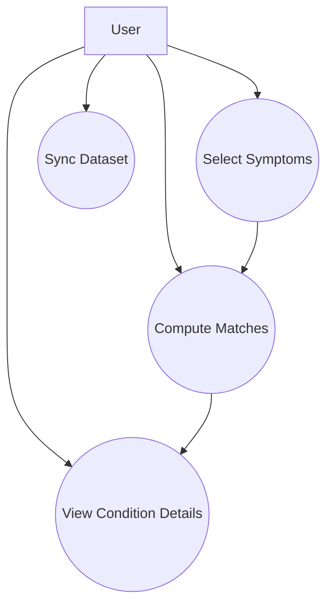

## Class Diagram

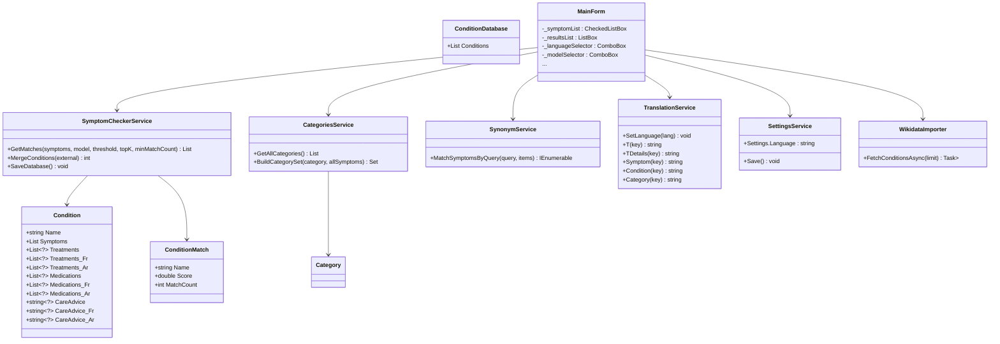

## Sequence Diagram — Check and Details

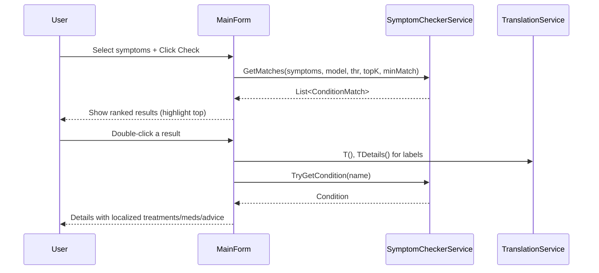

## Activity Diagram — Filtering and Selection

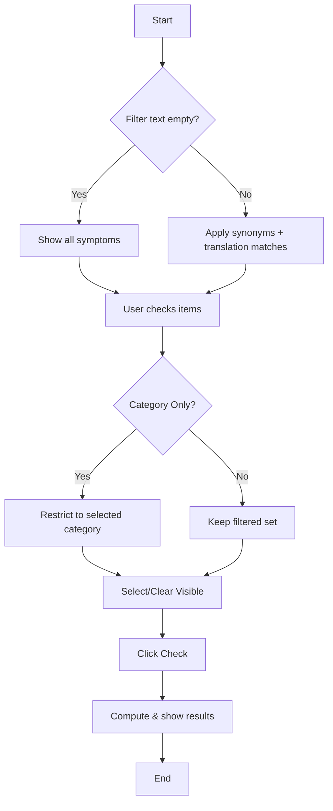

## State Machine — Language/RTL

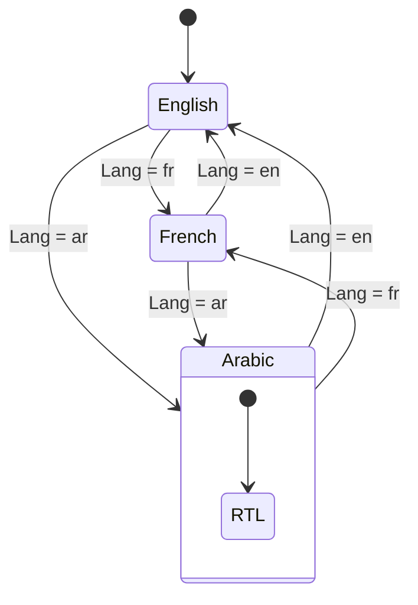

## Component Diagram

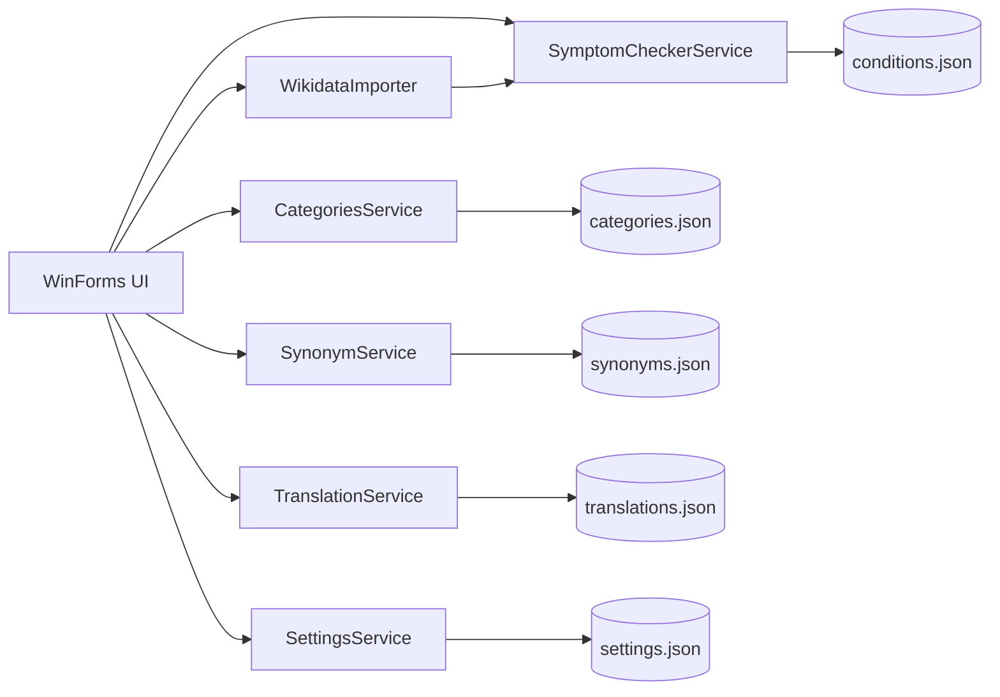

## Deployment Diagram

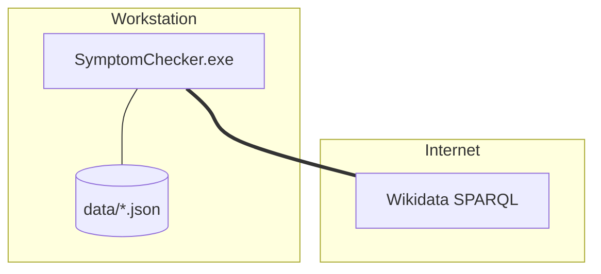

## Package Diagram

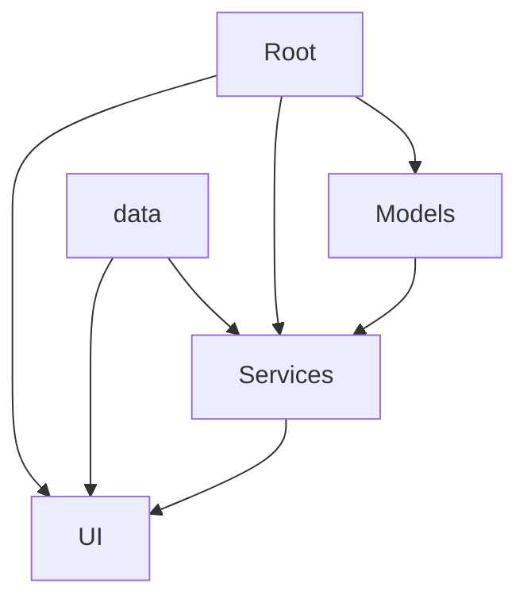

## Communication Diagram (approx.)

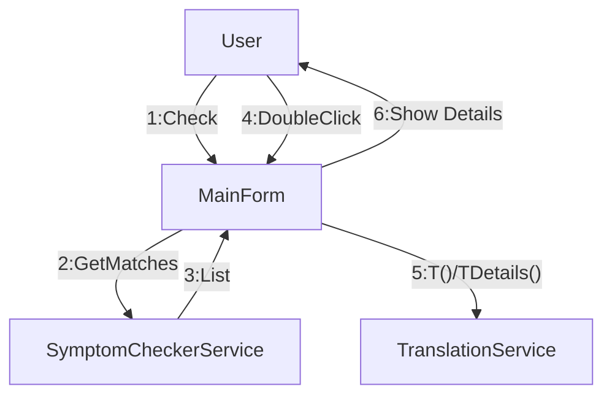

## Object Diagram (snapshot, approx.)

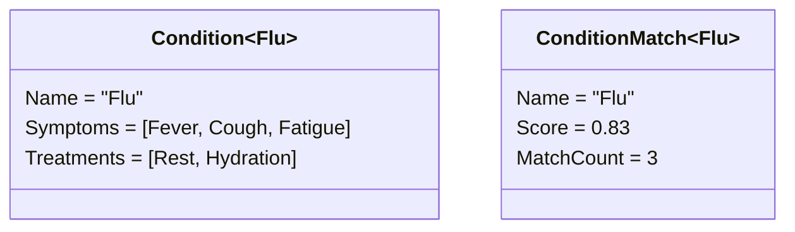

## Timing Diagram (approx.)

```mermaid
gantt
  dateFormat X
  title UI Response Timeline
  section Interaction
  Select symptoms        :done,    0, 1
  Compute matches        :active,  1, 1
  Render results         :         2, 0.5
  Open details           :         2.5, 0.5
```

## Composite Structure (approx.)

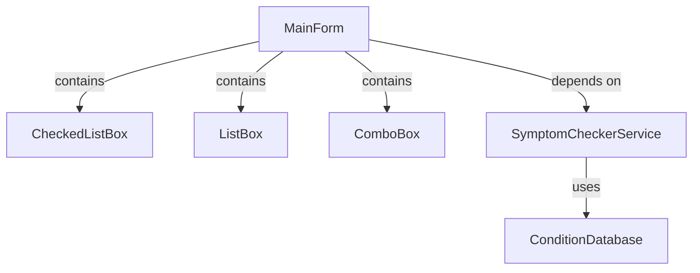
